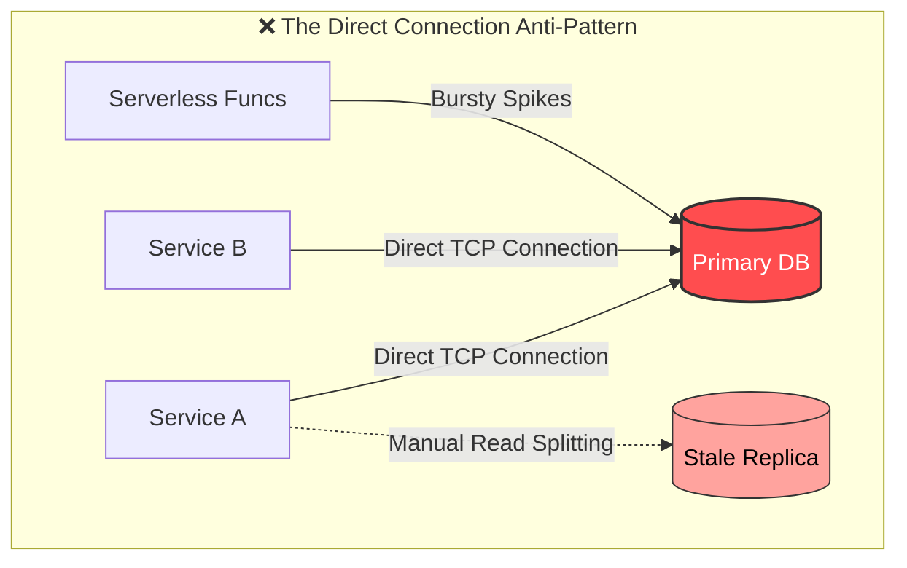
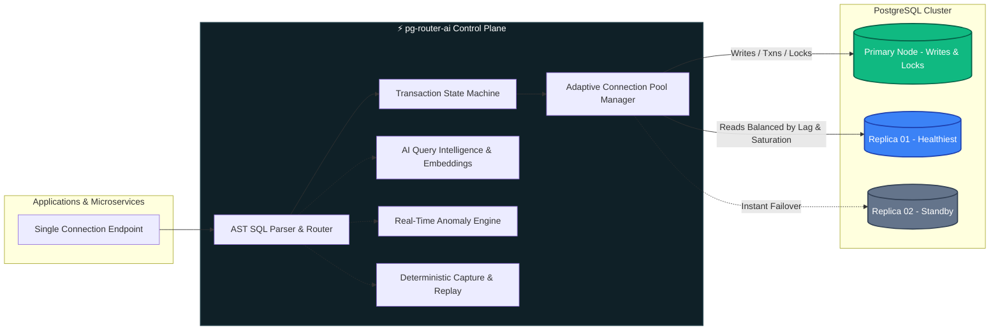
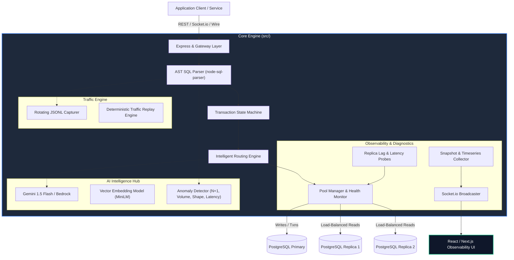
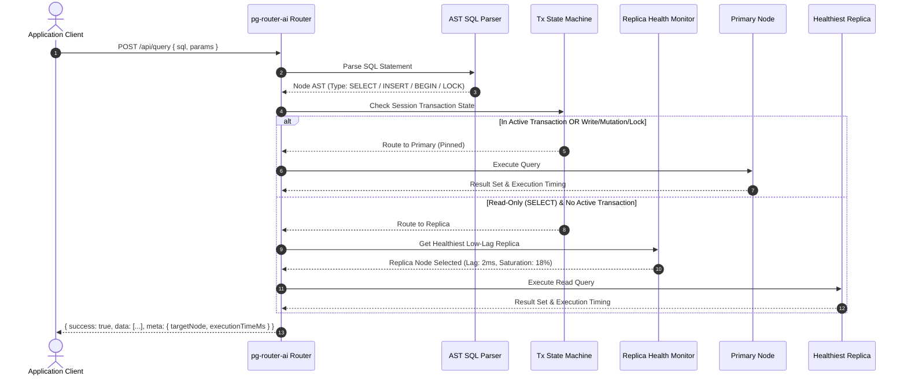

<div align="center">

# ⚡ pg-router-ai

### **Intelligent Query Router & Observability Platform for PostgreSQL**

*Every query. Precisely routed. One control plane to route, inspect, and replay PostgreSQL traffic — without changing application code.*

[](https://www.typescriptlang.org/)
[](https://nodejs.org/)
[](https://www.postgresql.org/)
[](https://socket.io/)
[](https://redis.io/)
[](https://ai.google.dev/)

---

</div>

## 📌 Table of Contents

- [The Direct Connection Dilemma](#-the-direct-connection-dilemma)
- [How pg-router-ai Saves You](#-how-pg-router-ai-saves-you)
- [Feature Comparison Matrix](#-feature-comparison-matrix)
- [System Architecture & Visual Flows](#-system-architecture--visual-flows)
  - [High-Level Architecture](#1-high-level-system-architecture)
  - [Query Routing Lifecycle](#2-query-routing-lifecycle)
  - [Deterministic Replay Pipeline](#3-deterministic-replay-pipeline)
- [Core Pillars](#-core-pillars)
  - [01 / Intelligent AST-Level Routing](#01--intelligent-ast-level-routing)
  - [02 / Real-Time Query Intelligence & AI](#02--real-time-query-intelligence--ai)
  - [03 / Continuous Anomaly Signals & Observability](#03--continuous-anomaly-signals--observability)
  - [04 / Deterministic Traffic Capture & Replay](#04--deterministic-traffic-capture--replay)
- [Directory Layout](#-directory-layout)
- [Quick Start](#-quick-start)
- [Configuration & Environment Variables](#-configuration--environment-variables)
- [REST API Reference](#-rest-api-reference)
- [Real-Time WebSocket Protocol](#-real-time-websocket-protocol)
- [Built-In Production Safeguards](#-built-in-production-safeguards)
- [Dashboard Integration](#-dashboard-integration)
- [License](#-license)

---

## 💥 The Direct Connection Dilemma

Connecting microservices, serverless functions, or monolithic apps directly to a raw PostgreSQL instance is a ticking time bomb for production systems. 



### Critical Failure Modes of Direct DB Connections:

1. **Connection Exhaustion & Thundering Herds:**
   Every microservice and serverless container maintains its own connection pool. During traffic spikes, connections skyrocket past PostgreSQL's `max_connections`, crashing the database with `FATAL: remaining connection slots are reserved for non-replication superuser connections`.
2. **Brittle Application-Level Read/Write Splitting:**
   Developers are forced to litter their ORM/codebase with dual connection strings (`PRIMARY_URL` vs `REPLICA_URL`), leading to dirty reads, race conditions, and missed transaction pinning.
3. **Replication Lag & Stale Reads:**
   Direct queries to replicas have zero awareness of replication delay. Reading right after a write (`read-your-own-writes`) yields missing data or phantom records.
4. **Catastrophic Silent Failovers:**
   When a primary or replica degrades, client applications throw uncaught TCP connection errors rather than transparently failing over to a healthy standby.
5. **Observability Blindspots & Runaway Queries:**
   Engineers have no centralized visibility into unindexed sequential table scans, N+1 query loops, or memory-hogging queries until the database CPU pegs at 100%.
6. **High-Risk Migrations & Unverified Queries:**
   There is no safe mechanism to record production traffic and shadow-replay it against new schemas, upgraded database versions, or staging clusters under real-world load.

---

## 🛡️ How pg-router-ai Saves You

`pg-router-ai` acts as an **intelligent, zero-overhead control plane** between your application tier and your PostgreSQL cluster.



- ✅ **Zero Code Changes:** Point your app to a single connection string. No manual read/write splitting logic required.
- ✅ **AST-Driven Routing:** Queries are parsed in memory using an Abstract Syntax Tree to identify writes, transactions, session-level locks, and read statements.
- ✅ **Transaction Pinning:** Automatically detects `BEGIN`, `COMMIT`, `ROLLBACK`, `FOR UPDATE`, and state changes, pinning subsequent operations to the primary node to prevent stale read anomalies.
- ✅ **Lag-Aware Load Balancing:** Actively health-checks replicas and calculates replication lag in milliseconds; routes reads only to healthy, synchronized nodes.
- ✅ **AI-Assisted Optimization:** Deep integration with Google Gemini and AWS Bedrock (DeepSeek) to explain query execution plans, recommend missing indexes, and auto-rewrite slow queries.
- ✅ **Real-Time Anomaly Signal:** Automatically flags N+1 query patterns, volume bursts, unseen query shapes (semantic embeddings), and latency regressions over WebSockets.
- ✅ **Production Shadow Replay:** Record live traffic to sanitized JSONL captures and replay them against staging/replicas at variable speeds (0.5x, 1x, 2x, 10x).

---

## 📊 Feature Comparison Matrix

| Capability | Direct Database Connection | Traditional Pooler (PgBouncer) | ⚡ pg-router-ai |
| :--- | :---: | :---: | :---: |
| **Connection Pooling** | ❌ App-dependent | ✅ Basic TCP pooling | ✅ **Adaptive & Lag-Aware** |
| **Automatic Read/Write Split** | ❌ Manual ORM code | ❌ Not supported | ✅ **AST-Level SQL Parsing** |
| **Transaction State Pinning** | ❌ Manual | ⚠️ Session/Tx Mode only | ✅ **Automatic Context Pinning** |
| **Replication Lag Guard** | ❌ Ignored | ❌ Ignored | ✅ **Real-time Lag Monitoring** |
| **AI Query Optimizer** | ❌ None | ❌ None | ✅ **Gemini / Bedrock AI Insights** |
| **Anomaly & N+1 Detection** | ❌ Post-mortem logs | ❌ None | ✅ **Sub-second Vector Detection** |
| **Live WebSocket Observability**| ❌ None | ❌ None | ✅ **Real-Time Stream via Socket.io** |
| **Traffic Capture & Replay** | ❌ Expensive log parsers | ❌ None | ✅ **Deterministic Speed Replay** |
| **Natural Language to SQL** | ❌ None | ❌ None | ✅ **Built-in NL-to-SQL Engine** |

---

## 🏗️ System Architecture & Visual Flows

### 1. High-Level System Architecture



### 2. Query Routing Lifecycle



### 3. Deterministic Replay Pipeline

```mermaid
flowchart LR
    ProdTraffic[Live Production Queries] --> Capturer[JSONL Rotating Capture]
    Capturer --> Storage[(Capture Log: captures/*.jsonl)]
    
    Storage --> Replayer[Deterministic Replay Engine]
    Replayer --> SpeedCtrl[Speed Controller: 0.5x | 1x | 2x | 10x]
    SpeedCtrl --> StagingDB[(Staging / Upgraded Postgres Instance)]
    
    Replayer --> Comparator[Latency & Result Difference Engine]
    Comparator --> OutputReport[Performance & Regression Report]

    style Storage fill:#334155,stroke:#64748b,stroke-width:2px,color:#fff
    style StagingDB fill:#1e3a8a,stroke:#3b82f6,stroke-width:2px,color:#fff
```

---

## 💎 Core Pillars

### 01 / Intelligent AST-Level Routing
- **Fine-Grained AST Introspection:** Categorizes queries into `READ`, `WRITE`, `TRANSACTION_BEGIN`, `TRANSACTION_COMMIT`, `SCHEMA_DDL`, or `SESSION_LOCK`.
- **Automatic Fallback & Failover:** If a replica node fails or exceeds lag threshold (`REPLICA_LAG_THRESHOLD_MS`), reads gracefully reroute to another replica or the primary seamlessly.
- **Weighted Dynamic Load Balancing:** Replicas receive queries according to real-time connection pool availability and measured query latency.

### 02 / Real-Time Query Intelligence & AI
- **Automated EXPLAIN Plan Analysis:** Submits slow or complex queries to Google Gemini 1.5 Flash / AWS Bedrock (DeepSeek) to decode cost models into plain-English remediation advice.
- **Missing Index & Rewrite Suggestions:** Generates exact `CREATE INDEX CONCURRENTLY` statements and optimized SQL queries to replace unindexed scans.
- **Natural Language to SQL:** Generates safe, parameterized queries directly from plain English prompts against the known database schema.

### 03 / Continuous Anomaly Signals & Observability
- **N+1 Query Bursts:** Identifies identical parameterized queries executed in rapid bursts (< 2000ms) without batching.
- **Semantic Vector Query Shapes:** Extracts structural embeddings using `sentence-transformers/all-MiniLM-L6-v2` to alert when an unfamiliar query structure hits production.
- **Volume & Latency Spikes:** Emits immediate alerts if queries cross percentile thresholds or if query volume spikes uncontrollably.

### 04 / Deterministic Traffic Capture & Replay
- **Non-blocking JSONL Capture:** Captures query text, sanitized parameter types, execution duration, and timestamp metadata with zero production overhead.
- **Speed Multiplier Replay:** Replays recorded production traces at `0.5x`, `1.0x`, `2.0x`, or `10.0x` speeds to benchmark new index strategies or database major version upgrades.

---

## 📂 Directory Layout

```
backend/
├── captures/               # Rotating captured production traffic (JSONL)
├── data/                   # Local caches, mock metrics, and state persistence
├── scripts/
│   └── simulate-anomalies.js # Interactive 4-in-1 anomaly injection script
├── src/
│   ├── ai/                 # AI Engines: Gemini, Bedrock, HuggingFace embeddings, NL-to-SQL
│   ├── api/
│   │   ├── middleware/     # Auth (Supabase/Firebase/JWT), CORS, rate limiter, helmet
│   │   ├── routes/         # Express REST routes (query, ai, metrics, replay, dashboard)
│   │   ├── sockets/        # Socket.io event dispatchers & room managers
│   │   └── docs/           # OpenAPI / Swagger specification
│   ├── config/             # App, database, Redis, AI model parameters
│   ├── monitors/           # Real-time health checker, replica lag, time-series collectors
│   ├── replay/             # Traffic capturer, parser, and deterministic replay worker
│   ├── router/             # AST SQL parser, transaction state machine, pool manager
│   ├── types/              # TypeScript interfaces, enums, DTOs
│   ├── utils/              # Winston logger, custom errors, circuit breakers, validators
│   └── server.ts           # Main application entrypoint
├── tests/                  # Jest test suites (unit & integration)
├── traffic-probe.js        # Synthetic traffic generator for load testing
├── Dockerfile              # Production container build definition
├── package.json
└── tsconfig.json
```

---

## 🚀 Quick Start

### 1. Clone & Install Dependencies

```bash
cd backend
npm install
```

### 2. Configure Environment

Copy the example environment file:
```bash
cp .env.example .env
```

> **Zero Database Required for Local Testing!**  
> Set `SIMULATE_DB=true` and `AUTH_DISABLED=true` in `.env` to run full simulation mode with simulated primary and replica nodes.

### 3. Run Development Server

```bash
npm run dev
```

- 🌐 **REST API:** `http://localhost:3000`
- 📚 **Swagger Docs:** `http://localhost:3000/docs`
- ⚡ **WebSocket Gateway:** `ws://localhost:3000`

### 4. Execute Tests & Simulation Scripts

```bash
# Run unit & integration test suite
npm test

# Generate continuous realistic synthetic traffic
npm run traffic

# Inject and trigger all 4 anomaly types (N+1, Volume, New Shape, Latency)
npm run anomaly:simulate
```

---

## ⚙️ Configuration & Environment Variables

| Variable | Default | Description |
| :--- | :--- | :--- |
| `PORT` | `3000` | Express REST & Socket.io server port |
| `PRIMARY_DATABASE_URL` | `postgresql://...` | Connection URI for the Primary (Read/Write) PostgreSQL node |
| `REPLICA_DATABASE_URLS`| `["postgresql://..."]` | JSON array of PostgreSQL Read Replica connection URIs |
| `SIMULATE_DB` | `false` | When `true`, runs in-memory simulated database cluster |
| `REDIS_URL` | `redis://localhost:6379`| Optional Redis connection for AI caching & metrics (falls back to memory) |
| `GEMINI_API_KEY` | - | Google AI API key for query optimization & NL-to-SQL |
| `GEMINI_MODEL` | `gemini-1.5-flash` | Gemini model variant for execution plan analysis |
| `BEDROCK_MODEL_ID` | `deepseek.v3.2` | AWS Bedrock model identifier for DeepSeek AI optimization |
| `HUGGINGFACE_API_KEY` | - | Hugging Face API key for vector semantic embedding generation |
| `SLOW_QUERY_THRESHOLD_MS` | `100` | Latency threshold in ms to trigger slow query alerts |
| `REPLICA_LAG_THRESHOLD_MS`| `1000` | Maximum acceptable replication lag before draining replica node |
| `CAPTURE_DIR` | `./captures` | Directory for rotating traffic replay logs |
| `AUTH_DISABLED` | `true` (dev) | Set to `false` in production to enforce JWT/Bearer validation |

---

## 📡 REST API Reference

All responses conform to the standard payload envelope:
```json
{
  "success": true,
  "data": { ... },
  "error": null,
  "meta": {
    "timestamp": "2026-09-25T23:50:00.000Z",
    "executionTimeMs": 4.2
  }
}
```

### Key Endpoints

| Method | Endpoint | Description |
| :--- | :--- | :--- |
| `POST` | `/api/query` | Parses, routes, and executes a SQL query on optimal node |
| `POST` | `/api/query/explain` | Returns AST routing decision (Primary vs Replica) without executing |
| `GET` | `/api/queries` | Retrieves recent query execution history & routing telemetry |
| `GET` | `/api/nodes` | Returns status, pool saturation, and replication lag for all nodes |
| `GET` | `/api/metrics/dashboard` | Aggregated dashboard snapshot (QPS, Latency p95/p99, Error rate) |
| `GET` | `/api/metrics/timeseries` | Time-series query metrics for graphing |
| `GET` | `/api/slow-queries` | Returns the slowest executed queries with execution profiles |
| `POST` | `/api/ai/optimize` | Generates AI index recommendations & rewritten SQL queries |
| `POST` | `/api/ai/convert` | Converts natural language requests to valid, secure PostgreSQL queries |
| `GET` | `/api/anomalies` | Fetches detected query anomalies with severity filters |
| `POST` | `/api/anomalies/:id/ack` | Acknowledges and silences an active anomaly alert |
| `POST` | `/api/replay/capture/start` | Begins logging production traffic to rotating JSONL files |
| `POST` | `/api/replay/start` | Triggers deterministic replay at designated speed multiplier |

---

## 🔌 Real-Time WebSocket Protocol

Connect via Socket.io client with optional JWT handshake auth:

```javascript
import { io } from "socket.io-client";

const socket = io("http://localhost:3000", {
  auth: { token: "YOUR_BEARER_TOKEN" }
});

// Subscribe to real-time feeds
socket.emit("subscribe:metrics");
socket.emit("subscribe:alerts");

// Listen for live database events
socket.on("metrics:update", (metrics) => {
  console.log("Live QPS & Latency:", metrics);
});

socket.on("alert:anomaly", (alert) => {
  console.warn("🚨 Anomaly Detected:", alert.title, alert.description);
});
```

### Event Matrix

| Direction | Event Name | Payload / Description |
| :--- | :--- | :--- |
| **Client → Server** | `subscribe:metrics` | Joins room for real-time node & throughput updates |
| **Client → Server** | `subscribe:alerts` | Joins room for real-time anomaly alerts |
| **Client → Server** | `editor:join` | Joins collaborative query editor session room |
| **Server → Client** | `metrics:update` | Real-time QPS, active connections, and latency metrics |
| **Server → Client** | `node:status` | Node health transitions (Online, Lagging, Drained, Offline) |
| **Server → Client** | `alert:anomaly` | Triggered when N+1, latency spike, or shape anomaly is detected |
| **Server → Client** | `replay:progress` | Real-time percentage & speed progress during traffic replay |

---

## 🔒 Built-In Production Safeguards

- **SQL Injection Defense:** AST tokenization ensures single statement execution per request and flags destructive command heuristics.
- **SQL Payload Guard:** Strict 20KB maximum query length restriction to prevent memory denial-of-service.
- **AI Circuit Breakers:** Per-minute rate limits and automatic fallback to rule-based heuristics if AI provider APIs time out or exceed quota.
- **Redis Response Caching:** AI optimization recommendations and vector embeddings are cached for 1 hour to prevent redundant LLM billing.
- **Strict Security Headers:** Fully protected with Helmet, customizable CORS whitelisting, and Express IP rate limiters (100 req/min default).

---

## 🖥️ Dashboard Integration

`pg-router-ai` is engineered to seamlessly power the `pg-router-ai` Next.js/Vite Observability Dashboard.

1. Deploy the backend to your infrastructure (Docker, Render, Railway, Fly.io, or AWS ECS) with your PostgreSQL connection strings.
2. In the frontend dashboard, navigate to **Settings → Backend Connection**.
3. Paste the backend URL (e.g. `https://api.yourdomain.com`).
4. The dashboard header will turn to **`● live · backend`** with real-time WebSocket telemetry.

---

<div align="center">

Built with ❤️ for High-Scale PostgreSQL Systems

**[Explore Documentation](http://localhost:3000/docs)** • **[Report an Issue](https://github.com/aky2004/pg-router-ai/issues)**

</div>
